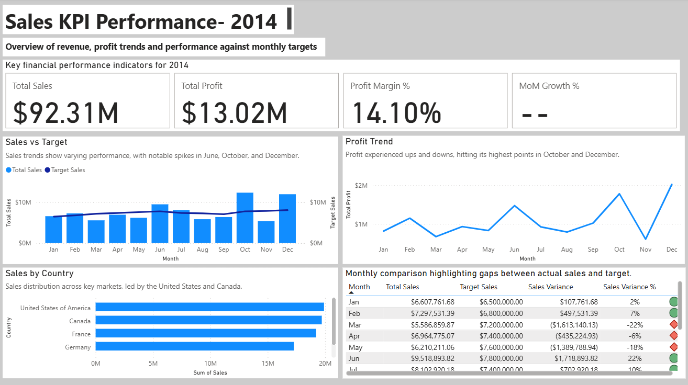

# 📊 KPI Dashboard — Financial Sample (2014)

## 👀 Recruiter Snapshot (30-second read)

**What this shows:**
An executive-ready **Power BI KPI dashboard** analyzing **2014 sales performance vs targets**, profit, margin, and MoM trends.

**Why it matters:**
Demonstrates the ability to turn raw financial data into **decision-focused insights** using proper data modeling, DAX, and business storytelling.

**Skills proven:**
Power BI • DAX (KPIs & time intelligence) • Data modeling • Executive dashboards • Business insight communication

**Outcome:**
Clear visibility into revenue gaps, margin pressure periods, and high-performing markets — supporting faster, data-driven management decisions.

---

## 🔍 Project Overview

This project delivers an **executive-level KPI dashboard** built in **Power BI**, designed to evaluate **sales performance against targets**, **profitability**, and **month-over-month (MoM) trends** for the year **2014**.

The dashboard is structured for **business stakeholders**, enabling quick answers to:

* *Are we hitting our revenue targets?*
* *Which months and markets drive performance?*
* *How healthy are our margins over time?*

---

## 🎯 Objective

Create a clean, decision-ready KPI dashboard that highlights:

* Revenue vs Target performance
* Profit and Profit Margin trends
* Month-over-Month growth patterns
* Country-level sales contribution

Using the **What → So What → Now What** storytelling approach to translate data into actions.

---

## 📁 Dataset

**1. Financial_Sample_2014.xlsx**
Cleaned transactional sales data for 2014.

**2. Revenue_Targets.xlsx**
Monthly revenue targets for 2014.

📂 All datasets are stored in the `/data/` directory.

---

## 🧩 Data Model

**Fact Table**

* `Financials` — Sales, Profit, Date, Product, Country

**Dimension Tables**

* `Date` — Calendar table for 2014

**Target Table**

* `Targets_2014` — Monthly sales targets

**Relationships**

* `Date[Date]` → `Financials[Date]` (1 → many)
* `Date[Month] / Date[Period]` → `Targets_2014[Month] / Targets_2014[Period]` (1 → many)

This star-schema design ensures accurate time-based analysis and scalable reporting.

---

## 🛠 Tools & Skills Applied

* **Power BI Desktop**

  * Power Query (data cleaning & transformation)
  * Data modeling (relationships & date table)
* **DAX**

  * KPI measures & time intelligence
* **Business Intelligence**

  * KPI design
  * Executive storytelling

---

## 📐 Key Measures (Summary)

* **Total Sales**
* **Total Profit**
* **Profit Margin %**
* **Target Sales**
* **Sales Variance**
* **Sales Variance %**
* **Revenue (Previous Month)**
* **MoM Growth %**

📄 Full DAX definitions available in:
`/docs/dax-formulas.md`

---

## 📊 Dashboard Highlights

**Top KPIs**

* Total Sales: **$92.31M**
* Total Profit: **$13.02M**
* Average Profit Margin: **14.1%**

**Visual Insights**

* Monthly Sales vs Target comparison
* Profit trend with seasonal spikes
* Sales contribution by country
* Tabular variance analysis for executive review

📸 Screenshot:



---

## 🧠 Key Insights

* Revenue exceeded targets in **7 out of 12 months**, with peak performance in **October and December**.
* Profitability remained stable despite sales fluctuations, averaging **~14.1% margin**.
* Margin pressure observed between **July–September**, likely linked to higher discounting.

---

## 📌 Business Recommendations

* Reassess discount strategies during mid-year periods to protect margins.
* Set dynamic monthly targets that reflect seasonal demand patterns.
* Prioritize high-performing markets (e.g. United States & Canada) for growth initiatives.

---

## 💼 Business Value

This dashboard delivers **direct decision-making value** for leadership and commercial teams:

* **Faster executive decisions**
  Consolidates revenue, profit, and target performance into a single view, reducing manual reporting time and enabling quicker monthly reviews.

* **Early performance detection**
  Month-over-Month tracking highlights sales slowdowns or margin pressure early, allowing proactive corrective actions.

* **Target accountability**
  Clear Sales vs Target and variance metrics improve ownership at the monthly level and support performance-based planning.

* **Margin protection**
  Visibility into profit and margin trends helps identify periods of excessive discounting and supports pricing strategy adjustments.

* **Scalable reporting framework**
  The data model and DAX measures are reusable for future years, enabling YoY analysis and enterprise-wide KPI standardization.

---

## 🔗 Project Files

```
/data
  ├─ Financial_Sample_2014.xlsx
  ├─ Revenue_Targets.xlsx

/docs
  ├─ dax-formulas.md

/output_screenshot
  ├─ dashboard_screenshot.png

KPI_Dashboard_Financial_Sample.pbix
```

---

## 👤 Author

**Nawwarah Yusof**
Data Analyst | Power BI & Business Intelligence

📌 *This project is part of my BI portfolio, focused on building executive-ready dashboards and actionable insights.*
