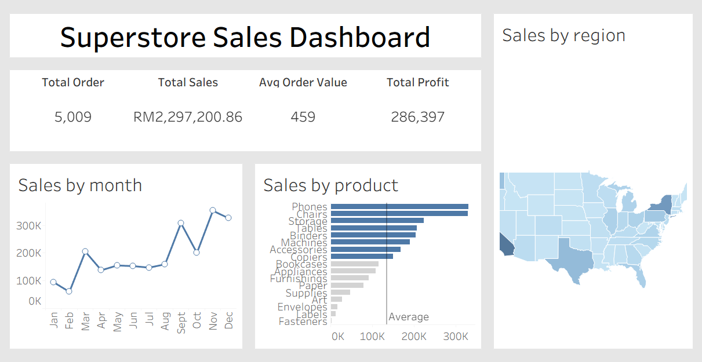

# Sales Overview Dashboard (Tableau)

## Overview
This Tableau dashboard visualizes Superstore’s 2014–2017 sales performance, focusing on total orders, sales, profit, product performance, and regional trends.  
The data was cleaned and prepared in BigQuery before being connected to Tableau.

##  Storytelling Narrative
- **Total Sales** and **Total Profit** show steady growth across the timeline, mainly driven by the *Technology* category.
- **Average Order Value (AOV)** remains consistent, suggesting stable customer spending.
- **West Region** dominates both sales and profit, while other regions show moderate performance.
- **Top 10 Products** contribute a significant portion of total revenue, highlighting product concentration opportunities.
- **Monthly Sales Trend** reveals a cyclical pattern with peaks during mid-year and end-of-year months.
- Overall, the business demonstrates strong performance and growth potential in technology-related segments.

##  Key Metrics
| Metric | Description | Calculation |
|--------|-------------|--------------|
| Total Orders | Number of unique orders | COUNTD([Order ID]) |
| Total Sales | Total revenue | SUM([Sales]) |
| Average Order Value | Sales per order | SUM([Sales]) / COUNTD([Order ID]) |
| Total Profit | Total profit after cost | SUM([Profit]) |
| MoM % Change | Month-over-month change in sales | Calculated using LOD + DATEADD formula |

## Visualizations Included
1. KPI Cards – Total Sales, Orders, AOV, Profit, MoM%
2. Sales by Month (Trend Line)
3. Sales by Product (Top 10)
4. Sales by Region (Map / Bar Chart)

## Tools Used
- **Google BigQuery** – Data storage & preprocessing  
- **Tableau Public** – Data visualization & dashboard creation  
- **GitHub** – Documentation & project showcase

## Screenshot

---

### Insights Summary
Overall, Superstore’s performance indicates strong growth potential, especially in the Technology category and West region.  
Future strategies can focus on expanding high-margin products and optimizing discount strategies to sustain profit growth.

